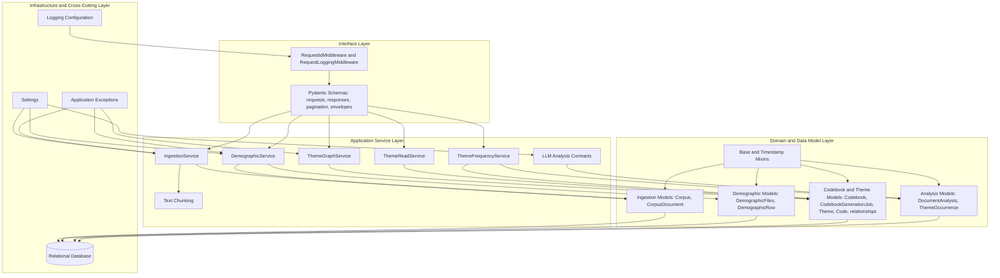
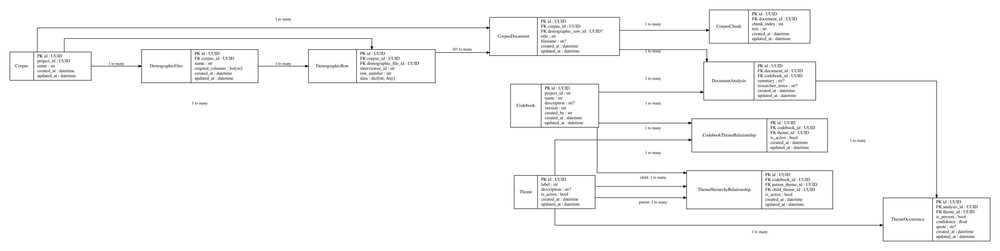
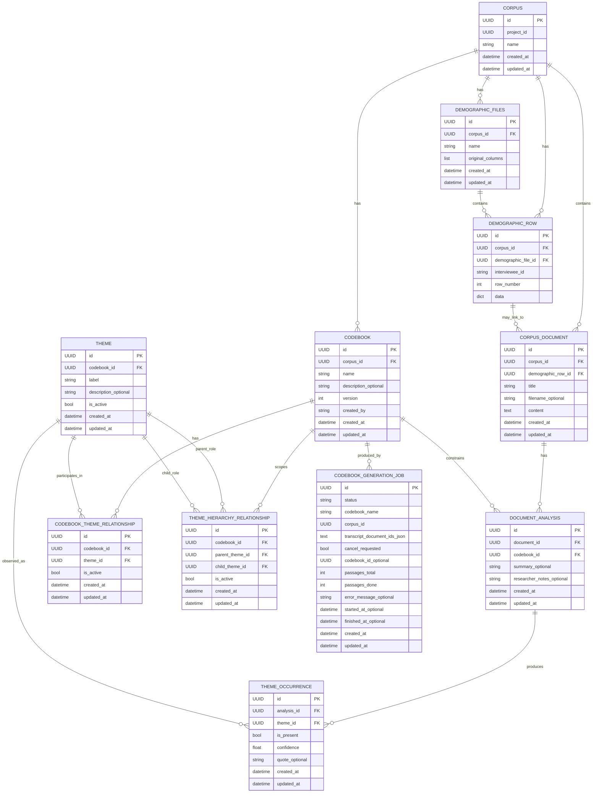

# Backend Software Architecture and Data Model Documentation

Source: generated from the `classes_BackendApp.dot` pyreverse class graph.

This document presents a non-decorative architectural abstraction of the backend. It separates runtime responsibilities from persistence structures and avoids implementation-specific visual clutter.

## 1. Architectural Overview

The backend is organized as a layered application. The observable structure indicates the following principal layers:

1. **Interface layer**: request/response schemas, pagination envelopes, middleware, and validation contracts.
2. **Application service layer**: procedural business operations for ingestion, demographic processing, theme graph computation, theme reading, and frequency aggregation.
3. **Domain/data model layer**: SQLAlchemy-backed persistent entities representing corpora, documents, demographic files, codebooks, themes, analyses, and theme occurrences.
4. **Infrastructure and cross-cutting layer**: configuration, logging, and domain-specific exception classes.

## 2. Main Service Responsibilities

| Service or component | Scientific role | Primary data dependency |
|---|---|---|
| `IngestionService` | Creates corpora, ingests documents (`.txt`, `.docx`, `.pdf`, `.jsonl`), and lists corpus artifacts. | `Corpus`, `CorpusDocument` |
| `DemographicService` | Imports demographic CSV-like data, confirms temporary uploads, lists demographic records, and links demographic rows to transcripts. | `DemographicFiles`, `DemographicRow`, `CorpusDocument` |
| `ThemeGraphService` | Constructs and validates a directed acyclic graph of themes within a codebook. | `Theme`, `ThemeHierarchyRelationship`, `Codebook` |
| `ThemeReadService` | Provides a readable tree representation of the theme hierarchy. | `Theme`, `ThemeHierarchyRelationship` |
| `ThemeFrequencyService` | Computes aggregate theme occurrence statistics across analyses. | `ThemeOccurrence`, `Theme`, `DocumentAnalysis` |
| `CodebookGenerationService` | Splits document content into passages at runtime, invokes the LLM pipeline per passage, and consolidates generated themes and codes into a persisted codebook. | `CodebookGenerationJob`, `Codebook`, `Theme`, `Code` |
| LLM analysis contracts | Represent structured model output before persistence into analysis tables. | `InterviewAnalysisResult`, `ThemePresence`, `DocumentAnalysis`, `ThemeOccurrence` |

## 3. Persistent Data Model

The following model is a conceptual ERM derived from the class graph and the foreign-key-like attributes visible in the model classes.

## 4. Entity Catalogue

### 4.1 Corpus and document ingestion

| Entity | Description | Key attributes |
|---|---|---|
| `Corpus` | Logical collection of source documents within a project. | `id`, `project_id`, `name` |
| `CorpusDocument` | A single ingested document or transcript. Stores both metadata and the full document text. It may be linked to one demographic row. | `id`, `corpus_id`, `demographic_row_id`, `title`, `filename`, `content` |

### 4.2 Demographic data

| Entity | Description | Key attributes |
|---|---|---|
| `DemographicFiles` | Imported demographic file metadata and original column structure. | `id`, `corpus_id`, `name`, `original_columns` |
| `DemographicRow` | One normalized row of imported demographic data. | `id`, `corpus_id`, `demographic_file_id`, `interviewee_id`, `row_number`, `data` |

### 4.3 Codebook and theme graph

| Entity | Description | Key attributes |
|---|---|---|
| `Codebook` | Versioned coding framework associated with a corpus. | `id`, `corpus_id`, `name`, `description`, `version`, `created_by` |
| `CodebookGenerationJob` | Background job that generates a codebook from corpus transcripts via the LLM pipeline. | `id`, `status`, `codebook_name`, `corpus_id`, `cancel_requested`, `passages_total`, `passages_done`, `codebook_id`, `error_message` |
| `Theme` | A node in the codebook hierarchy (theme, subtheme, or code label). | `id`, `codebook_id`, `label`, `description`, `is_active` |
| `CodebookThemeRelationship` | Association table mapping themes into codebooks. | `id`, `codebook_id`, `theme_id`, `is_active` |
| `ThemeHierarchyRelationship` | Directed edge between parent and child themes within a codebook. | `id`, `codebook_id`, `parent_theme_id`, `child_theme_id`, `is_active` |

### 4.4 Analysis

| Entity | Description | Key attributes |
|---|---|---|
| `DocumentAnalysis` | Analysis result for a document under a specific codebook. | `id`, `document_id`, `codebook_id`, `summary`, `researcher_notes` |
| `ThemeOccurrence` | Observation of a theme within a document analysis, including evidence and confidence. | `id`, `analysis_id`, `theme_id`, `is_present`, `confidence`, `quote` |

