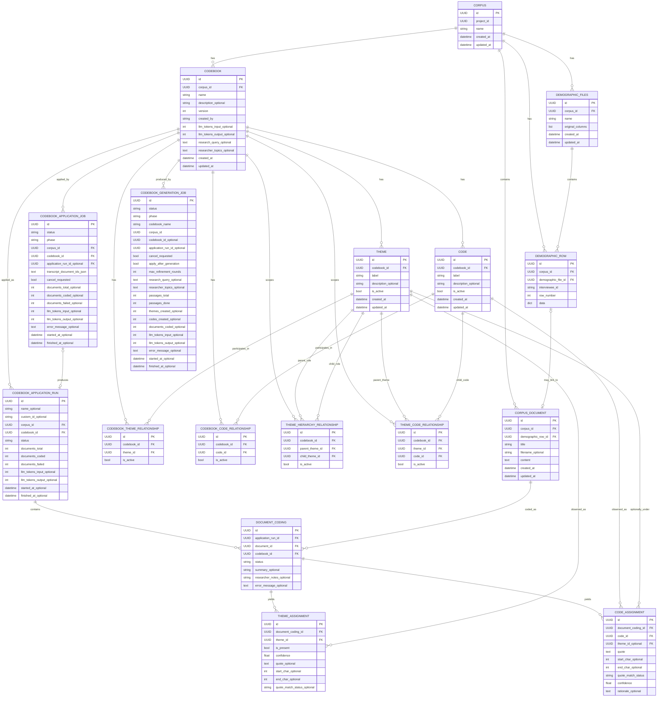

# Backend Software Architecture and Data Model Documentation

This document presents a non-decorative architectural abstraction of the backend. It separates runtime responsibilities from persistence structures and avoids implementation-specific visual clutter.

## 1. Architectural Overview

The backend is organized as a layered application. The observable structure indicates the following principal layers:

1. **Interface layer**: request/response schemas, pagination envelopes, middleware, and validation contracts.
2. **Application service layer**: procedural business operations for ingestion, demographic processing, codebook CRUD/parsing, the traceable generation-and-application pipeline, theme graph/frequency/quote/demographic reads, run export, and cross-cutting deletion guards.
3. **Domain/data model layer**: SQLAlchemy-backed persistent entities representing corpora, documents, demographic files, codebooks, themes, codes, generation/application jobs, application runs, and per-document coding results.
4. **Infrastructure and cross-cutting layer**: configuration, logging, background upload cleanup, app-level settings, and domain-specific exception classes.

```mermaid
flowchart TB
    subgraph Interface_Layer[Interface Layer]
        MW[RequestIdMiddleware and RequestLoggingMiddleware]
        SC[Pydantic Schemas: requests, responses, pagination, envelopes]
    end

    subgraph Application_Service_Layer[Application Service Layer]
        IS[IngestionService]
        DS[DemographicService]
        CBS[CodebookService: CRUD]
        CBP[Codebook CSV parser]
        TAS[TraceableAnalysisService: generate + apply pipeline]
        CGS[CodebookGenerationService + job runner]
        CAS[CodebookApplicationService + job runner]
        TGS[ThemeGraphService]
        TFS[ThemeFrequencyService]
        TQS[ThemeQuotesService]
        TDB[ThemeDemographicBreakdownService]
        RES[RunExportService]
        ADG[AnalysisDependencyGuard]
        LINK[Linking: auto-link + manual link]
    end

    subgraph Domain_Data_Model_Layer[Domain and Data Model Layer]
        IM[Ingestion Models: Corpus, CorpusDocument]
        DM[Demographic Models: DemographicFiles, DemographicRow]
        CM[Codebook Models: Codebook, Theme, Code, membership and hierarchy relationships]
        JM[Job Models: CodebookGenerationJob, CodebookApplicationJob]
        AM[Application Models: CodebookApplicationRun, DocumentCoding, ThemeAssignment, CodeAssignment]
        SM[AppSetting]
        BM[Base and Timestamp Mixins]
    end

    subgraph Infrastructure_Layer[Infrastructure and Cross-Cutting Layer]
        CFG[Settings]
        EXC[Application Exceptions]
        LOG[Logging Configuration]
        UPC[Upload cleanup background loop]
        DB[(Relational Database)]
    end

    MW --> SC
    SC --> IS
    SC --> DS
    SC --> CBS
    SC --> CGS
    SC --> CAS
    SC --> TGS
    SC --> TFS
    SC --> TQS
    SC --> TDB
    SC --> RES

    IS --> IM
    DS --> DM
    DS --> IM
    LINK --> IM
    LINK --> DM
    CBS --> CM
    CBP --> CBS
    CGS --> TAS
    CAS --> TAS
    TAS --> CM
    TAS --> AM
    CGS --> JM
    CAS --> JM
    TGS --> CM
    TFS --> AM
    TFS --> CM
    TQS --> AM
    TDB --> AM
    TDB --> DM
    RES --> AM
    RES --> DM
    ADG --> JM

    IM --> DB
    DM --> DB
    CM --> DB
    JM --> DB
    AM --> DB
    SM --> DB
    BM --> IM
    BM --> DM
    BM --> CM
    BM --> JM
    BM --> AM

    CFG --> IS
    CFG --> DS
    CFG --> TAS
    EXC --> IS
    EXC --> DS
    EXC --> TGS
    UPC --> DS
    LOG --> MW
```

## 2. Main Service Responsibilities

| Service or component | Scientific role | Primary data dependency |
|---|---|---|
| `IngestionService` | Creates/lists/deletes corpora, ingests documents (`.txt`, `.docx`, `.pdf`, `.jsonl`), copies documents between corpora (including atomically creating a new corpus from a selected document subset), guarded by `AnalysisDependencyGuard` on delete. | `Corpus`, `CorpusDocument` |
| `DemographicService` | Imports demographic CSV data, confirms/cancels temporary uploads, lists/deletes demographic records, triggers auto-linking to transcripts. | `DemographicFiles`, `DemographicRow`, `CorpusDocument` |
| `linking` (module) | Auto-links transcripts to demographic rows by matching document title against `interviewee_id`; supports manual link/unlink. | `CorpusDocument`, `DemographicRow` |
| `CodebookService` | Creates a codebook plus its `Theme`/`Code` rows and membership/hierarchy edges atomically; reads and deletes codebooks. | `Codebook`, `Theme`, `Code`, relationship tables |
| `codebook_parser` | Parses an uploaded codebook CSV (`node type`, `name`, `description`, `parent name`) into typed `NodeInput` rows (THEME/SUBTHEME/CODE), enforcing 1-50 node count and hierarchy references. | in-memory only, feeds `CodebookService` |
| `TraceableAnalysisService` | The core grounded pipeline: extracts quote-grounded codes per document, consolidates near-duplicate codes via embeddings + LLM classification, synthesizes codes into subthemes/themes, iteratively reviews/refines against held-out documents, and (optionally) performs the final deductive coding pass over all documents. Every code and theme assignment is traceable back to an exact transcript quote and character span. | `Codebook`, `Theme`, `Code`, `CodebookApplicationRun`, `DocumentCoding`, `ThemeAssignment`, `CodeAssignment` |
| `CodebookGenerationService` + job runner | Wraps `TraceableAnalysisService.run_analysis` for the "generate a new codebook from transcripts" use case; tracks async job progress/phase/cancellation. | `CodebookGenerationJob` |
| `CodebookApplicationService` + job runner | Applies an **existing** codebook to selected/all transcripts in its corpus (deductive coding only, no code/theme synthesis), delegating the actual LLM pass to `TraceableAnalysisService._apply_codebook_to_documents`. | `CodebookApplicationJob`, `CodebookApplicationRun` |
| `ThemeGraphService` | Builds and validates a directed acyclic tree of themes and codes within a codebook (single-parent, no cycles), using `anytree`. | `Theme`, `Code`, `ThemeHierarchyRelationship`, `ThemeCodeRelationship` |
| `ThemeFrequencyService` | Computes per-theme occurrence counts and interview coverage percentage for one application run, rolling up parent-theme occurrence through the hierarchy. | `ThemeAssignment`, `Theme`, `DocumentCoding` |
| `ThemeQuotesService` | Paginated, confidence-ranked list of quotes assigned to one theme within an application run. | `ThemeAssignment`, `DocumentCoding`, `CorpusDocument` |
| `ThemeDemographicBreakdownService` | Breaks a theme's presence down by one or more demographic dimensions, flagging small samples. | `ThemeAssignment`, `DocumentCoding`, `DemographicRow` |
| `RunExportService` | Builds CSV exports of one application run's results, in theme-based or participant-based shape. | `ThemeAssignment`, `DocumentCoding`, `Theme`, `CorpusDocument`, `DemographicRow` |
| `AnalysisDependencyGuard` | Blocks deletion of documents/codebooks/corpora that have active (queued/running) application jobs unless `force=True`; cancels the affected jobs when forced. | `CodebookApplicationJob` |
| `app_settings` service | Reads/writes the single active LLM provider setting, with fallback: stored value → env default → FAU. | `AppSetting` |
| `quote_matching` | Locates an LLM-returned quote inside the source transcript (exact → whitespace-normalized → fuzzy match), producing character offsets used by all theme/code assignments. | in-memory only |
| `remote_embeddings` | OpenAI-compatible embeddings client against the FAU gateway; used to prefilter similar code candidates before LLM-based consolidation. | in-memory only |
| `upload_cleanup` | Background loop (started at app startup) that purges expired pending demographic-upload files from disk. | filesystem only |

## 3. Persistent Data Model

The following model is a conceptual ERM derived from the current SQLAlchemy models.

## 4. Entity Catalogue

### 4.1 Corpus and document ingestion

| Entity | Description | Key attributes |
|---|---|---|
| `Corpus` | Logical collection of source documents within a project. | `id`, `project_id`, `name` |
| `CorpusDocument` | A single ingested document or transcript. Stores both metadata and the full document text. It may be linked to one demographic row. | `id`, `corpus_id`, `demographic_row_id`, `title`, `filename`, `content` |

### 4.2 Demographic data

| Entity | Description | Key attributes |
|---|---|---|
| `DemographicFiles` | Imported demographic file metadata and original column structure. | `id`, `corpus_id`, `name`, `original_columns` |
| `DemographicRow` | One normalized row of imported demographic data. | `id`, `corpus_id`, `demographic_file_id`, `interviewee_id`, `row_number`, `data` |

### 4.3 Codebook, theme, and code graph

| Entity | Description | Key attributes |
|---|---|---|
| `Codebook` | Coding framework associated with a corpus. `version` is a simple per-corpus incrementing integer; true multi-version coexistence is not implemented (explicitly a placeholder in the model docstring). | `id`, `corpus_id`, `name`, `description`, `version`, `created_by`, `research_query`, `researcher_topics` |
| `Theme` | A theme or subtheme node in the codebook hierarchy. **Does not represent codes** — codes are a separate entity (see `Code`). | `id`, `codebook_id`, `label`, `description`, `is_active` |
| `Code` | A leaf-level code, persisted as its own first-class entity distinct from `Theme`. | `id`, `codebook_id`, `label`, `description`, `is_active` |
| `CodebookThemeRelationship` | Association table mapping themes into codebooks. | `id`, `codebook_id`, `theme_id`, `is_active` |
| `CodebookCodeRelationship` | Association table mapping codes into codebooks. | `id`, `codebook_id`, `code_id`, `is_active` |
| `ThemeHierarchyRelationship` | Directed edge between parent and child themes/subthemes within a codebook. | `id`, `codebook_id`, `parent_theme_id`, `child_theme_id`, `is_active` |
| `ThemeCodeRelationship` | Directed edge attaching a code to its parent theme/subtheme within a codebook. | `id`, `codebook_id`, `theme_id`, `code_id`, `is_active` |

**Code vs. Theme:** a CSV codebook upload (or LLM-generated codebook) with a `THEME`/`SUBTHEME`/`CODE` node type column persists each row as its real type: `THEME` and `SUBTHEME` rows become `Theme` records connected via `ThemeHierarchyRelationship`, while `CODE` rows become `Code` records attached to their parent `Theme` via `ThemeCodeRelationship`. Codes are **not** flattened into `Theme` rows.

### 4.4 Jobs and application runs

| Entity | Description | Key attributes |
|---|---|---|
| `CodebookGenerationJob` | Background job that generates a **new** codebook from corpus transcripts via the traceable pipeline, optionally applying it to all documents once generated. | `id`, `status`, `phase`, `codebook_name`, `corpus_id`, `cancel_requested`, `apply_after_generation`, `max_refinement_rounds`, `codebook_id`, `application_run_id`, progress counters, `llm_tokens_input`/`llm_tokens_output` (live token usage), `error_message` |
| `CodebookApplicationJob` | Background job that applies an **existing** codebook to selected (or all) transcripts in its corpus (deductive coding only). | `id`, `status`, `phase`, `corpus_id`, `codebook_id`, `transcript_document_ids_json`, `cancel_requested`, `application_run_id`, progress counters, `llm_tokens_input`/`llm_tokens_output` (live token usage), `error_message` |
| `CodebookApplicationRun` | One concrete application of a codebook to a selected transcript set — produced by either job type. | `id`, `name`, `custom_id`, `corpus_id`, `codebook_id`, `status`, `documents_total`, `documents_coded`, `documents_failed`, `llm_tokens_input`/`llm_tokens_output` |
| `DocumentCoding` | Coding result for one transcript within one application run. | `id`, `application_run_id`, `document_id`, `codebook_id`, `status`, `summary`, `researcher_notes`, `error_message` |
| `ThemeAssignment` | Theme-level presence assessment for one coded transcript, with supporting quote and character offsets. | `id`, `document_coding_id`, `theme_id`, `is_present`, `confidence`, `quote`, `start_char`, `end_char`, `quote_match_status` |
| `CodeAssignment` | Span-level code assignment for one coded transcript, with supporting quote, character offsets, and rationale. | `id`, `document_coding_id`, `code_id`, `theme_id`, `quote`, `start_char`, `end_char`, `quote_match_status`, `confidence`, `rationale` |

### 4.5 Application settings

| Entity | Description | Key attributes |
|---|---|---|
| `AppSetting` | Single-row-per-key generic settings store (currently used only to persist the active LLM provider selection across restarts). | `key` (PK), `value` |

## 5. Traceability

Every `ThemeAssignment` and `CodeAssignment` carries the exact supporting `quote` plus `start_char`/`end_char` offsets into the source transcript, and a `quote_match_status` (`exact`, `normalized`, `fuzzy`, or `not_found`) recording how confidently that quote was located. This is what "traceable" means throughout the codebase: every theme or code that the pipeline reports can be traced back to a specific, locatable span of participant text, both for LLM-generated codebooks (`TraceableAnalysisService.run_analysis`) and for applying an already-existing codebook to new transcripts (`CodebookApplicationService`, which reuses the same deductive-coding step).
