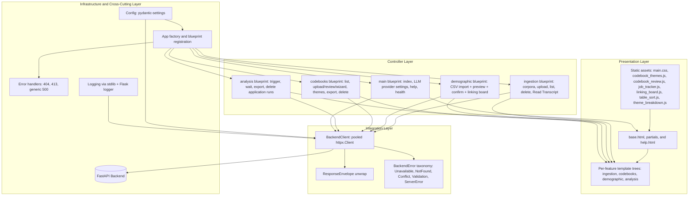

## 1. Architectural Overview

The frontend is organized as a layered server-rendered application. The observable structure indicates the following principal layers:

1. **Presentation layer**: Jinja2 templates, Bootstrap-5 styling, page-scoped JavaScript, and shared static assets.
2. **Controller layer**: Flask blueprints that bind URL paths to request handlers, perform input validation, and orchestrate redirects and flash messages.
3. **Integration layer**: an HTTP client that wraps every FastAPI backend call behind a typed error taxonomy.
4. **Infrastructure and cross-cutting layer**: Pydantic-settings configuration, Flask error handlers, request logging, and the app factory.



## 2. Main Component Responsibilities

| Component | Role | Primary collaborators |
|---|---|---|
| App factory (`web/__init__.py`) | Creates the Flask application, registers blueprints under their URL prefixes, installs error handlers, lazily instantiates the shared `BackendClient`, and registers an `atexit` hook to close it on process exit. | `Config`, all blueprints, `BackendClient` |
| `Config` (`web/config.py`) | Reads runtime configuration from environment variables via `pydantic-settings`. | App factory, `BackendClient` |
| `BackendClient` (`web/services/backend_client.py`) | Single point of contact with the FastAPI backend. Pools connections, unwraps the `ResponseEnvelope`, translates HTTP/network failures into typed `BackendError` subclasses, and logs one structured line per failed request. | All blueprints, FastAPI backend |
| `corpus_context` (`web/services/corpus_context.py`) | Resolves/creates the "active" corpus for a request (default single-workspace corpus, or one selected via the corpus picker), shared by every blueprint's landing routes. | `BackendClient.list_corpora`/`create_corpus` |
| `main` blueprint (no prefix) | Home page (with the active LLM provider card and a form to change it), the static Help page, the Legal Notices page, and the container health check. | `BackendClient.get_llm_provider`/`set_llm_provider` |
| `ingestion` blueprint (`/transcripts`) | Corpus creation/deletion (including creating a new corpus from a subset of selected transcripts), transcript upload (alongside the codebook-CSV and demographic-CSV cards on the same Uploads page), transcript listing/deletion, and the **Read Transcript** view (full text with speaker highlighting and, given `?run_id=`, inline theme/code highlighting from a coding run). | `BackendClient` corpus/document methods, `create_corpus_from_documents`, `get_document_content`, `list_codebook_application_runs`, `get_codebook_application_run_documents` |
| `demographic` blueprint (`/demographic`) | CSV demographic imports: preview, confirm/discard, list, delete, view rows, and the **linking board** (drag-and-drop transcript <-> demographic-row linking). Legacy `/demographic/upload` URLs redirect to the Uploads page. | `BackendClient` demographic + linking methods |
| `codebooks` blueprint (`/codebooks`) | Codebook list, CSV/manual/LLM-generation creation wizard (mode select -> naming -> progress, or upload -> review editor), the theme browser, and CSV export of codebook structure. | `BackendClient` codebook + generation-job methods |
| `analysis` blueprint (`/analysis`) | "Trigger Analysis" — applying an existing codebook to selected/all transcripts (creates a `CodebookApplicationJob`), progress polling, export/delete of past application runs. | `BackendClient` analysis-job + application-run methods |
| Error handlers (`web/__init__.py`) | Translate uncaught Flask errors into branded pages: 404, 413 (oversized upload — always redirects to home, never to a user-controlled `Referer`), and generic 500 without leaking tracebacks. | `templates/errors/` |

**Terminology note**: "codebook generation" (synthesizing a new codebook from transcripts, via the `codebooks` blueprint's wizard) and "codebook application" / "analysis" (deductively coding an *existing* codebook onto transcripts, via the `analysis` blueprint) are two distinct backend features that share the same underlying traceable pipeline. See [codebook-generation.md](codebook-generation) and [codebook-application.md](codebook-application).

## 3. Route Catalogue

All routes are server-rendered. Where a backend call is made, the client method is listed; routes without one render entirely from configuration or session state.

### 3.1 `main` (no URL prefix)

| Method and path | Purpose | Backend call |
|---|---|---|
| `GET /` | Home page: quick-link cards + active LLM provider card | `get_llm_provider` |
| `POST /settings/llm-provider` | Save the active LLM provider from a form on the home page | `set_llm_provider` |
| `GET /help` | Static, searchable Help & Documentation page | — |
| `GET /legal-notices` | Legal notices / third-party license attributions page, rendered from `web/static/legal_notices.json` | — |
| `GET /health` | Container health probe, returns `{"status": "ok"}` | — |

### 3.2 `ingestion` — prefix `/transcripts`

| Method and path | Purpose | Backend call |
|---|---|---|
| `GET /transcripts/` | Resolve the active corpus, redirect to its corpus-scoped list view | `resolve_active_corpus` |
| `GET /transcripts/upload` | Resolve the active corpus, redirect to its corpus-scoped Uploads page | `resolve_active_corpus` |
| `GET /transcripts/<corpus_id>/upload` | Render the Uploads page: transcripts card, codebook-CSV card, demographic-CSV card, and a corpus selector | `resolve_active_corpus` |
| `POST /transcripts/corpora` | Create a new corpus from the Uploads page's corpus selector | `create_corpus` |
| `POST /transcripts/<corpus_id>/delete` | Delete a corpus (optional `force_delete=1`); a `409` from an active application job is surfaced as a pending-delete confirmation | `delete_corpus` |
| `POST /transcripts/<corpus_id>/upload` | Validate file count/size, submit the multipart upload, render per-file results | `upload_files` |
| `GET /transcripts/<corpus_id>/` | List documents in a corpus with demographic-link badges | `list_documents`, `get_demographic_link_summary` |
| `POST /transcripts/<corpus_id>/<document_id>/delete` | Delete one transcript (optional force) | `delete_document` |
| `POST /transcripts/<corpus_id>/delete_transcripts` | Bulk-delete transcripts selected via checkboxes | `delete_document` (looped) |
| `POST /transcripts/<corpus_id>/create_corpus_from_transcripts` | Create a new corpus seeded from transcripts selected via checkboxes on the list page, then redirect into the new corpus's list view | `create_corpus_from_documents` |
| `GET /transcripts/<corpus_id>/<document_id>/read` | **Read Transcript** — full text with Q/A speaker highlighting; with `?run_id=`, also highlights theme/code assignments from that application run inline | `get_document_content`, `list_codebooks`, `list_codebook_application_runs`, `get_codebook_application_run_documents`, `get_theme_tree` |

### 3.3 `demographic` — prefix `/demographic`

| Method and path | Purpose | Backend call |
|---|---|---|
| `GET /demographic/` | Resolve corpus, redirect to its confirmed-files list | `resolve_active_corpus` |
| `GET /demographic/upload` | **Legacy redirect** to the Uploads page | — |
| `GET /demographic/<corpus_id>/` | List confirmed demographic file imports for the corpus | `list_demographic_files` |
| `GET /demographic/<corpus_id>/upload` | **Legacy redirect** to `/transcripts/<corpus_id>/upload` | — |
| `POST /demographic/<corpus_id>/upload` | Submit the CSV from the Uploads page's demographic card; stash the preview in session keyed by `import_id` | `upload_demographic` |
| `GET /demographic/<corpus_id>/preview/<import_id>` | Render the preview of a pending import (reads the session entry, no backend re-fetch) | — |
| `POST /demographic/<corpus_id>/preview/<import_id>` | Confirm or discard a pending import; clears the session entry | `confirm_demographic` |
| `POST /demographic/<corpus_id>/delete/<file_id>` | Delete one demographic file | `delete_demographic_file` |
| `POST /demographic/<corpus_id>/delete` | Bulk-delete selected demographic files | `delete_demographic_file` (looped) |
| `GET /demographic/<corpus_id>/linking` | **Linking board** — drag-and-drop UI matching transcripts to demographic rows | `get_demographic_link_summary` |
| `POST /demographic/<corpus_id>/linking/link` | AJAX: link (or reassign) a transcript to a demographic row | `link_transcript` |
| `POST /demographic/<corpus_id>/linking/unlink` | AJAX: remove a transcript's demographic link | `unlink_transcript` |
| `GET /demographic/<corpus_id>/view/<file_id>` | Paginated row view of one confirmed demographic file, with a linked-transcript column | `list_demographic_files`, `list_demographic_rows`, `get_demographic_link_summary` |

### 3.4 `codebooks` — prefix `/codebooks`

| Method and path | Purpose | Backend call |
|---|---|---|
| `GET /codebooks/` | Resolve corpus, redirect to its corpus-scoped codebook list | `resolve_active_corpus` |
| `GET /codebooks/upload` | Redirect to the Uploads page focused on the codebook card | `resolve_active_corpus` |
| `GET /codebooks/<corpus_id>/` | List codebooks for a corpus plus in-progress generation jobs | `list_codebooks`, `list_generation_jobs` |
| `GET /codebooks/<codebook_id>/themes` | Legacy back-compat route; resolves the active corpus and redirects into the corpus-scoped theme browser URL | `resolve_active_corpus` |
| `GET /codebooks/<corpus_id>/<codebook_id>/themes` | **Theme browser** — frequency table, hierarchy tree (themes + codes), theme details panel, demographic-dimension breakdown, application-run selector | `list_codebooks`, `list_codebook_application_runs`, `get_theme_frequencies`, `get_theme_tree`, `get_codebook`, `get_demographic_dimensions` |
| `GET /codebooks/<corpus_id>/<codebook_id>/themes/<theme_id>/demographic-breakdown.json` | AJAX: per-theme demographic breakdown for the details panel | `get_theme_demographic_breakdown` |
| `GET /codebooks/<corpus_id>/<codebook_id>/themes/<theme_id>/quotes.json` | AJAX: paginated supporting quotes for a theme | `get_theme_quotes` |
| `GET /codebooks/<corpus_id>/<codebook_id>/export` | Export one codebook's structure as a CSV download | `get_codebook` |
| `POST /codebooks/<corpus_id>/export` | Export multiple selected codebooks as one ZIP (one CSV each) | `get_codebook` (looped) |
| `POST /codebooks/<corpus_id>/upload` | Handle codebook CSV upload from the Uploads page; parses and renders the review editor | `parse_csv_preview` |
| `GET /codebooks/<corpus_id>/manual` | Blank review editor for fully-manual codebook entry | — |
| `POST /codebooks/<corpus_id>/confirm` | Validate and persist the reviewed/edited codebook (upload, manual, or wizard "semi" flow); detects a no-op edit against `source_codebook_id` | `get_codebook`, `create_codebook`, `delete_codebook` (best-effort draft cleanup) |
| `GET /codebooks/<corpus_id>/success` | "Codebook saved" confirmation page | `get_codebook` |
| `GET /codebooks/new` | Resolve corpus, redirect into the generation wizard | `resolve_active_corpus` |
| `GET /codebooks/new/<corpus_id>` | **Wizard step 1** — choose coding mode: `auto` / `semi` / `manual` | — |
| `POST /codebooks/new/<corpus_id>` | Handle mode selection: auto/semi -> naming form, manual -> Uploads page | — |
| `GET /codebooks/new/<corpus_id>/auto` | **Wizard step 2** — name the codebook and optionally set a research question/topics | `get_llm_provider` (label display) |
| `POST /codebooks/new/<corpus_id>/auto` | Validate inputs, create an LLM generation job, redirect to progress (semi) or the codebook list with a background tracker (auto) | `create_generation_job` |
| `GET /codebooks/new/jobs/<job_id>` | **Wizard step 3** — live progress page for a generation job | — |
| `GET /codebooks/new/jobs/<job_id>.json` | AJAX: poll generation job status | `get_generation_job` |
| `GET /codebooks/new/<corpus_id>/auto-demo` | Demo flow: creates a real hardcoded sample codebook with a scripted ~5s progress UI, no LLM call | `create_codebook` |
| `POST /codebooks/new/jobs/<job_id>/cancel` | AJAX: cancel an in-flight generation job | `cancel_generation_job` |
| `GET /codebooks/<codebook_id>/review` | Open the review editor pre-filled with an existing codebook (edit flow) | `get_codebook` |
| `POST /codebooks/<codebook_id>/review` | Save an edited codebook as a new version | `get_codebook`, `create_codebook` |
| `POST /codebooks/<corpus_id>/<codebook_id>/delete` | Delete one codebook (a `409` from an active application job is surfaced as a pending-delete confirmation) | `delete_codebook` |
| `POST /codebooks/<corpus_id>/delete` | Bulk-delete selected codebooks | `delete_codebook` (looped) |

### 3.5 `analysis` — prefix `/analysis`

| Method and path | Purpose | Backend call |
|---|---|---|
| `GET /analysis/` | **Trigger Analysis** page: select transcripts + codebook, list previous application runs across the corpus's codebooks, show the active LLM provider | `list_documents`, `list_codebooks`, `list_codebook_application_runs`, `get_llm_provider` |
| `POST /analysis/trigger` | Create a codebook-application job, redirect to the wait page | `trigger_analysis` |
| `GET /analysis/job/<job_id>` | "Applying Codebook" live progress page | — |
| `GET /analysis/job/<job_id>/status` | AJAX: poll job status | `get_analysis_job` |
| `POST /analysis/job/<job_id>/cancel` | Cancel a running (or demo) analysis job | `cancel_analysis_job` |
| `GET /analysis/demo` | Demo flow: scripted analysis progress with fake data, no backend calls | — |
| `POST /analysis/runs/export` | Bundle selected application runs as one ZIP (one CSV per run x per chosen format: theme-based / participant-based) | `fetch_run_export_csv` (looped) |
| `POST /analysis/runs/delete` | Hard-delete selected application runs | `delete_codebook_application_run` (looped) |

## 4. Page Catalogue

Templates are organized by feature under `Frontend/web/templates/`. All templates extend `base.html`.

### 4.1 Shared

| Template | Purpose |
|---|---|
| `base.html` | Bootstrap layout, navbar (Home / Upload / Transcripts / Demographic Data / Codebooks / Analysis / Help), 3-column footer, favicon, flash partial, globally-loaded JS (`job_tracker.js`, `selectable_list.js`, `table_sort.js`) |
| `_flash.html` | Dismissible alert partial with category-specific icons; `success`/`info` auto-dismiss after 5s, `warning`/`danger` persist |
| `_corpus_select.html` | Reusable corpus dropdown + "create new corpus" mini-form |
| `_delete_modal.html` | Generic reusable delete-confirmation modal |
| `_analysis_delete_confirm_modal.html` | Pending-delete confirmation modal specifically for deletes blocked by an active application job |
| `_selectable_list_toolbar.html` | "Select all" + selection-count toolbar for checkbox-driven list pages |
| `index.html` | Home page: quick-link cards + LLM provider selector |
| `help.html` | Static, searchable Help & Documentation page |
| `legal_notices.html` | Legal notices / third-party license attributions, rendered from `legal_notices.json` |
| `errors/404.html` | Branded "page not found" |
| `errors/500.html` | Branded "server error" — never leaks tracebacks |

### 4.2 Ingestion

| Template | Purpose |
|---|---|
| `ingestion/upload.html` | Uploads page: transcripts card (multi-file, indigo), codebook-CSV card, and demographic-CSV card (teal), plus corpus selector |
| `ingestion/results.html` | Per-file ingestion result summary |
| `ingestion/list.html` | Paginated transcript list for one corpus, with demographic-link badges and bulk delete |
| `ingestion/read.html` | **Read Transcript** — full text with Q/A speaker badges and, given a run, inline theme/code highlighting |

### 4.3 Demographic

| Template | Purpose |
|---|---|
| `demographic/preview.html` | Pending-import preview with confirm/cancel actions |
| `demographic/list.html` | List of confirmed demographic files for a corpus; links back to the Uploads page |
| `demographic/view.html` | Paginated row view of one demographic file, with transcript-linking badges |
| `demographic/linking.html` | Drag-and-drop linking board (transcripts <-> demographic rows), driven by `linking_board.js` |

### 4.4 Codebooks

| Template | Purpose |
|---|---|
| `codebooks/list.html` | Codebook list + in-progress generation-job cards |
| `codebooks/themes.html` | Theme browser: frequency table, hierarchy tree, theme details panel, demographic breakdown. Driven by `codebook_themes.js` and `theme_breakdown.js` |
| `codebooks/review.html` | Drag/reorder/indent editor for reviewing a codebook's themes/codes before saving (upload, manual, wizard "semi", and edit flows). Driven by `codebook_review.js` |
| `codebooks/success.html` | "Codebook saved successfully" confirmation page |
| `codebooks/new/mode_select.html` | Wizard step 1: choose coding mode |
| `codebooks/new/auto_form.html` | Wizard step 2: name + research question/topics |
| `codebooks/new/progress.html` | Wizard step 3: live generation-job progress |

### 4.5 Analysis

| Template | Purpose |
|---|---|
| `analysis/index.html` | Trigger Analysis page: transcript + codebook selection, previous application runs (export/delete) |
| `analysis/wait.html` | "Applying Codebook" live progress page |

## 5. Backend Integration Surface

`BackendClient` is the only point in the frontend that knows the FastAPI URL shape. Every method passes through a single `_unwrap(response, sub_key=None)` helper that peels the `{success, data, error, meta}` envelope — if the backend ever changes that shape, only `_unwrap` needs updating.

| Method | Endpoint | Used by |
|---|---|---|
| `list_corpora(corpus_id=None)` | `GET /ingestion/corpora` | `resolve_active_corpus` |
| `create_corpus(corpus_id, name)` | `POST /ingestion/corpora` | Corpus selector |
| `delete_corpus(corpus_id, force=False)` | `DELETE /ingestion/corpora/{id}` | Corpus deletion |
| `upload_files(corpus_id, files)` | `POST /ingestion/corpora/{id}/upload` | Transcript upload |
| `list_documents(corpus_id, page_size=50)` | `GET /ingestion/corpora/{id}/documents` | Transcript list |
| `get_document_content(corpus_id, document_id)` | `GET /ingestion/corpora/{id}/documents/{id}` | Read Transcript |
| `delete_document(corpus_id, document_id, force=False)` | `DELETE /ingestion/corpora/{id}/documents/{id}` | Transcript deletion |
| `copy_documents(source_corpus_id, target_corpus_id, document_ids)` | `POST /ingestion/corpora/{id}/documents/copy` | Copying documents into an existing corpus |
| `create_corpus_from_documents(source_corpus_id, name, document_ids)` | `POST /ingestion/corpora/{id}/create-corpus-from-documents` | "Create new corpus from selected transcripts" on the transcript list page |
| `list_codebooks(corpus_id=None)` | `GET /codebooks/` | Codebook list, theme browser, analysis |
| `get_codebook(codebook_id)` | `GET /codebooks/{id}` | Theme browser, export, review |
| `create_codebook(corpus_id, name, themes)` | `POST /codebooks/` | Review confirm, demo flow |
| `delete_codebook(codebook_id, force=False)` | `DELETE /codebooks/{id}` | Codebook deletion |
| `parse_csv_preview(file)` | `POST /codebooks/parse-csv` | Codebook CSV upload |
| `create_generation_job(...)` | `POST /codebooks/generate-jobs` | Generation wizard |
| `list_generation_jobs(corpus_id, statuses=None)` | `GET /codebooks/generate-jobs` | Codebook list (in-progress jobs) |
| `get_generation_job(job_id)` | `GET /codebooks/generate-jobs/{id}` | Wizard progress polling |
| `cancel_generation_job(job_id)` | `POST /codebooks/generate-jobs/{id}/cancel` | Wizard progress page |
| `get_theme_frequencies(codebook_id, application_run_id=None)` | `GET /codebooks/{id}/themes` | Theme browser |
| `get_theme_tree(codebook_id)` | `GET /codebooks/{id}/themes/tree` | Theme browser, Read Transcript |
| `get_theme_quotes(codebook_id, theme_id, page, page_size, application_run_id=None)` | `GET /codebooks/{id}/themes/{id}/quotes` | Theme details panel |
| `get_theme_demographic_breakdown(codebook_id, theme_id, dimensions, application_run_id=None)` | `GET /codebooks/{id}/themes/{id}/demographic-breakdown` | Theme details panel |
| `get_demographic_dimensions(corpus_id)` | `GET /demographic/{id}/dimensions` | Theme browser |
| `upload_demographic(corpus_id, file, name=None)` | `POST /demographic/{id}/upload` | Demographic upload |
| `confirm_demographic(corpus_id, import_id, confirm)` | `POST /demographic/{id}/confirm` | Demographic preview |
| `list_demographic_files(corpus_id, page_size=200)` | `GET /demographic/{id}/files` | Demographic list |
| `list_demographic_rows(corpus_id, file_id, page, page_size)` | `GET /demographic/{id}/rows` | Demographic file view |
| `delete_demographic_file(corpus_id, file_id)` | `DELETE /demographic/{id}/files/{id}` | Demographic file deletion |
| `get_demographic_link_summary(corpus_id)` | `GET /demographic/{id}/link-summary` | Linking board, transcript/theme browser badges |
| `link_transcript(corpus_id, document_id, demographic_row_id)` | `PUT /demographic/{id}/documents/{id}/link` | Linking board |
| `unlink_transcript(corpus_id, document_id)` | `DELETE /demographic/{id}/documents/{id}/link` | Linking board |
| `trigger_analysis(corpus_id, codebook_id, name=None, custom_id=None, transcript_document_ids=None)` | `POST /codebooks/{id}/apply-jobs` | Trigger Analysis |
| `get_analysis_job(job_id)` | `GET /codebooks/apply-jobs/{id}` | Analysis wait page |
| `cancel_analysis_job(job_id)` | `POST /codebooks/apply-jobs/{id}/cancel` | Analysis wait page |
| `list_codebook_application_runs(codebook_id)` | `GET /codebooks/{id}/application-runs` | Trigger Analysis, theme browser, Read Transcript |
| `get_codebook_application_run_documents(run_id)` | `GET /codebook-application-runs/{id}/documents` | Read Transcript |
| `delete_codebook_application_run(run_id)` | `DELETE /codebook-application-runs/{id}` | Analysis run deletion |
| `fetch_run_export_csv(run_id, export_format)` | `GET /codebook-application-runs/{id}/export` | Analysis run export (raw CSV, bypasses envelope) |
| `get_llm_provider()` | `GET /settings/llm-provider` | Home page, wizard |
| `set_llm_provider(provider)` | `PUT /settings/llm-provider` | Home page |

## 6. Error Model

A four-layer model is used. The categorisation lives in `BackendClient`; controllers catch the typed exception and surface `exc.user_message` via `flash`; templates render error- vs. empty-state separately; Flask error handlers catch what escapes.

| Exception class | Raised when | Default user message | Log level |
|---|---|---|---|
| `BackendError` (base) | Uncategorised failure: malformed JSON, missing keys | "Something went wrong. Please try again." | `error` |
| `BackendUnavailableError` | Connect refused, DNS failure, connect/read timeout | "We can't reach the analysis service right now. Please try again in a moment." | `warning` |
| `BackendNotFoundError` | Backend returns HTTP 404 | "The requested item couldn't be found. It may have been deleted." | `info` |
| `BackendConflictError` | Backend returns HTTP 409 (e.g. delete blocked by an active application job) | "This action conflicts with the current analysis state…" (parses the body for specifics) | `info` |
| `BackendValidationError` | Backend returns HTTP 422 — FastAPI's structured `detail[].msg` is parsed per field | A per-field message, e.g. `"name: field required; themes: must contain at least 1 item"` | `info` |
| `BackendServerError` | Backend returns 5xx | "The analysis service had a problem. The team has been notified." | `error` |

Controllers that hit a resource by id (e.g. `codebook_themes`, `demographic.view_data`) catch `BackendNotFoundError` separately to surface a resource-specific message. `BackendConflictError` is caught specifically around corpus/transcript/codebook deletion to drive the pending-delete confirmation modal. Generic `BackendError` is the fallback.

Data-loading templates follow a three-way conditional so an error alert and an empty-state line never appear together:

```jinja

  <p class="text-secondary">Couldn't load this section.</p>

  ...

  <p class="text-secondary">No items yet.</p>

```

Flask-level error handlers catch what escapes the controllers:

- **404** — renders `errors/404.html`.
- **413** — flashes "Upload too large…" and redirects to the home page via `url_for("main.index")`. **Always home** — never the `Referer` header — to eliminate the open-redirect class of vulnerability (CWE-601).
- **Generic `Exception`** — logs the full traceback via `logger.exception`, renders `errors/500.html`. Re-raises `HTTPException` so the 404 and 413 handlers still run for those specific codes.

## 7. Configuration

The frontend reads its configuration from environment variables (or a local `.env`).

| Variable | Default | Purpose |
|---|---|---|
| `APP_ENV` | `development` | `development` enables debug-friendly behaviour |
| `APP_DEBUG` | `False` | Flask debug flag |
| `APP_HOST` | `0.0.0.0` | Bind host |
| `APP_PORT` | `3000` | Bind port |
| `LOG_LEVEL` | `INFO` | Both Flask and `BackendClient` log at this level |
| `SECRET_KEY` | `dev-secret` | Flask session signing key. **Override for production.** |
| `BACKEND_API_URL` | `http://localhost:8000/api/v1` | Base URL of the FastAPI backend. In Docker this is `http://api:8000/api/v1`. |
| `BACKEND_TIMEOUT_S` | `60.0` | HTTP client timeout |
| `DEFAULT_CORPUS_ID` | `00000000-0000-0000-0000-000000000001` | Single-workspace MVP corpus identifier |
| `DEFAULT_CORPUS_NAME` | `Interview Transcripts` | Display fallback name; also used when auto-creating the default workspace corpus |
| `MAX_UPLOAD_SIZE_MB` | `10` | Per-file upload cap; Werkzeug rejects oversized bodies with 413 |
| `ACCEPTED_EXTENSIONS` | `.txt, .docx, .pdf, .jsonl` | File types accepted by the transcript upload form |

`MAX_UPLOAD_BYTES` (`MAX_UPLOAD_SIZE_MB * 1024 * 1024`) and `MAX_CONTENT_LENGTH` (`10 x MAX_UPLOAD_BYTES`, ~100 MB by default — the Flask raw-request-body cap that triggers a 413) are computed properties, not separately configurable.

## 8. Design System

The frontend uses a small, deliberate visual vocabulary. **New pages should reuse these primitives rather than introducing one-off styling.** If you find yourself reaching for inline styles or a custom class, check §8.8 first.

### 8.1 Bootstrap and stylesheet organisation

Bootstrap 5.3.3 is loaded from `cdn.jsdelivr.net` with an SRI integrity hash, declared in `templates/base.html`. No build step, no Bootstrap Icons, no Bootstrap extensions. We rely on default Bootstrap utility classes (`d-flex`, `gap-2`, `text-secondary`, `mb-3`, `bg-white`, `rounded-3`, etc.) wherever possible, and add custom classes only when Bootstrap can't express the intent.

`static/css/main.css` is the **only** custom stylesheet. It is sectioned with `/* ── Section name ─────── */` headings by feature. New rules go into the matching section, not appended at the end.

### 8.2 Colour identity

| Role | Colour | Where it appears |
|---|---|---|
| Institutional chrome | NIM red `#D7102D` + dark navy `#232B35` | Team logo (navbar + footer + favicon) |
| Content brand | Indigo `#3730a3 → #4f46e5 → #6366f1` | Theme-browser page header, metric cards, panel-title accents, footer accent line, transcripts upload card |
| Complementary content brand | Teal `#0f766e → #14b8a6` | Demographic upload card |
| Frequency progress bands | Rose 0–33 %, amber 34–66 %, emerald 67–100 % | Theme-browser coverage bars |

Dominant solid colours pulled from each gradient (used for buttons and accents):

| Token | Hex |
|---|---|
| Indigo deep | `#4338ca` |
| Indigo hover | `#3730a3` |
| Indigo disabled | `#c7d2fe` |
| Indigo selected-row tint | `#eef2ff` |
| Teal deep | `#0f766e` |
| Teal hover | `#115e59` |
| Teal disabled | `#ccfbf1` |

### 8.3 Reusable component classes

Full catalogue. Use these first; introduce a new class only when none of these fit.

**Cards and containers**

| Class | When to use |
|---|---|
| `.upload-card`, `.upload-card--indigo`, `.upload-card--teal` | Side-by-side upload entry points with gradient header strip, hover-lift, themed accent |
| `.metric-card`, `.metric-card--indigo`, `.metric-card--cyan`, `.metric-card--teal` | Stat cards with large numeric value and small uppercase label (theme browser) |
| `.theme-page-header` | Indigo gradient hero for theme-browser-style pages |
| `.panel-title` | Section heading inside a panel; indigo left-border accent |
| `.upload-row` | Soft max-width cap (1080 px) for the Uploads page row |

**Buttons**

| Class | When to use |
|---|---|
| `.btn-indigo` | Primary submit on an indigo-themed surface |
| `.btn-teal` | Primary submit on a teal-themed surface |

**File pickers**

| Class | When to use |
|---|---|
| `.file-list-item` | Borderless row for a selected file (name + size + hover tint) |
| `.file-list-remove` | Circular X-icon remove button |

**Tree (theme browser)**

| Class | When to use |
|---|---|
| `.tree-root`, `.tree-children`, `.tree-group`, `.tree-child-item` | Hierarchy tree connector lines |
| `.tree-root-row`, `.tree-child-row` | Tree node rows |
| `.tree-toggle`, `.tree-toggle-gap` | Expand/collapse arrows |

**Layout chrome**

| Class | When to use |
|---|---|
| `.site-body`, `.site-main`, `.site-footer` | Sticky-bottom flex layout on `<body>` |
| `.site-navbar` | Branded navbar background |
| `.site-flash` | Flash alert wrapper (auto-dismiss for success/info) |

### 8.4 Themed submit buttons

`.btn-indigo` and `.btn-teal` are flat solid buttons (background pulled from the dominant colour of each gradient — a compressed gradient on a small button reads as washed-out). They share a hover-darkening + soft glow + active-press pattern. The disabled state shows a muted variant and overrides Bootstrap's `pointer-events: none` so the `cursor: not-allowed` indicator actually renders.

### 8.5 File pickers

The `.file-list-item` + `.file-list-remove` pair is the canonical "selected file" affordance: borderless row with file name + size, hover tint, oversize-red tint when over the size cap, circular X-icon remove button. Used by both the transcripts multi-file list and the demographic single-file indicator.

### 8.6 Interaction patterns

| Pattern | What | Where it's used |
|---|---|---|
| Hover-lift | `transform: translateY(-4px)` + grown box-shadow on `:hover` | Upload cards |
| Click-press | `transform: translateY(-2px)` + reduced shadow on `:active` | Upload cards |
| Disabled cursor | `cursor: not-allowed` + `pointer-events: auto` override on `:disabled` (Bootstrap's default `pointer-events: none` hides the cursor change) | Themed submit buttons |
| Dismissible flash | `success` and `info` alerts auto-dismiss after 5 s via a small JS snippet in `base.html`; `warning` and `danger` persist | Flash partial |
| Three-way data-loading conditional | ` ...  ...  empty-state ` so error and empty-state never appear together | All data-loading templates |

### 8.7 Icons

We use inline SVG (Lucide / Heroicons style: `viewBox="0 0 24 24"`, `fill="none"`, `stroke="currentColor"`, `stroke-width="1.8"` or `2.4`, `stroke-linecap="round"`). No icon font, no SVG sprite.

| Use | Size |
|---|---|
| Card header | `width/height: 26-32px` |
| Inline control (remove buttons, toggles) | `width/height: 13-16px` |

### 8.8 Before adding new CSS — checklist

Run through this before writing a new rule in `main.css`:

1. **Does a Bootstrap utility cover it?** Spacing (`m-*`, `p-*`, `gap-*`), display (`d-flex`, `d-grid`), text (`text-secondary`, `fw-semibold`), borders (`border`, `rounded-2`), colours (`bg-light`, `text-bg-success`). If yes, use that — no new rule needed.
2. **Does an existing custom class cover it?** Check §8.3. The catalogue is shorter than people think.
3. **Is it a page-specific JS interaction?** If the styling exists only because of a JS state change (selected row, expanded tree node), the *class name* can live in `main.css` but the *event wiring* belongs alongside the JS in the template, not duplicated as CSS.

If all three answers are no, add it to `main.css` under the right `/* ── Section ─ */` heading, give it an intent-based name, and update §8.3 of this wiki in the same commit.

## 9. Multi-Step Flows

Several flows in the app follow the same "stage before commit" shape:

| Flow | Used by | Steps | State management |
|---|---|---|---|
| **Single-step** | Transcripts upload | Upload → backend persists immediately → render per-file results | None — request/response is self-contained |
| **Two-step preview/confirm** | Demographic upload | Upload → backend stages a pending file and returns a preview with `import_id` → user confirms or cancels on a separate page → backend persists or discards | The preview payload is stashed in `flask.session` under key `demo_preview_<import_id>`. The confirm route pops the entry after dispatching to backend. |
| **Parse/review/confirm** | Codebook CSV upload, manual entry, and the wizard's "semi" mode | Parse (or start blank) → render an editable review tree (`codebooks/review.html`) where the researcher can rename/reparent/delete nodes → confirm persists via `create_codebook` | The in-progress tree lives in the rendered form/session until confirm; `source_codebook_id` lets confirm detect a true no-op edit. |
| **Job + poll** | Codebook generation wizard, codebook application (Trigger Analysis) | Submit → backend creates a background job → progress page polls a `.../status` or `.../job/<id>/status` JSON endpoint via `job_tracker.js` → redirect once terminal | No session state; the job id in the URL is the only handoff. |

The demographic two-step flow exists because the backend enforces strict CSV validation and the team decided researchers should always see what was parsed before persisting. The parse/review/confirm flow for codebooks extends the same principle to a fully editable tree, since LLM-generated or CSV-uploaded codebooks may need manual correction before they're saved.

The `import_id` (demographic) and job `id` (codebook generation / analysis) are UUIDs generated by the backend and embedded in the relevant page URL. Pending demographic uploads expire on the backend after `DEMOGRAPHIC_UPLOAD_TTL_SECONDS`; the frontend gracefully handles the missing-session case with a flash + redirect back to the Uploads page.

## 10. Development Workflow

Day-to-day commands, troubleshooting, and the dev/test stack are documented in `Frontend/README.md` in the repository. One environmental gotcha worth highlighting here:

**Schema drift on the Postgres volume.** The project has no migration framework today; schema is created by `SQLAlchemy.create_all()` on app start, which only adds missing tables — not missing columns. Any time the backend team adds a column to an existing model, anyone whose local `pgdata` volume predates that commit will see `UndefinedColumnError` on any insert touching the new column. Cure:

```bash
docker compose down -v && docker compose up -d
```

This recreates the volume with the current schema. Loses all locally uploaded test data.

## 11. Testing Strategy

The frontend test suite lives under `Frontend/tests/`. Tests never hit the network — a `FakeBackend` fixture in `conftest.py` monkey-patches the BackendClient factory in every controller blueprint.

| File | Coverage |
|---|---|
| `test_smoke.py` | Health, home, and basic per-route reachability |
| `test_main_controller.py` | Home page and LLM provider settings form |
| `test_ingestion.py` | Transcript upload + list flows, including typed-error paths |
| `test_read_transcript.py` | Read Transcript page, including inline theme/code highlighting |
| `test_codebooks.py` | Codebook list + theme browser flows |
| `test_codebook_controller.py` | Codebook upload/review/confirm/wizard flows |
| `test_codebook_breakdown.py` | Theme demographic-breakdown AJAX endpoint |
| `test_demographic.py` | Demographic upload (via Uploads page redirect), preview, confirm/discard, file view |
| `test_linking.py` | Linking board link/unlink flows |
| `test_analysis.py` | Trigger Analysis, job polling, export, run deletion |
| `test_backend_client.py`, `test_backend_client_validation.py` | Unit tests for `BackendClient` exception categorisation using `httpx.MockTransport` |
| `test_error_handlers.py` | 404, 413, and generic 500 handlers, including the open-redirect guard on 413 |

To simulate a specific backend exception in a controller test, set the fixture's `raise_on`:

```python
fake_backend.raise_on = ("upload_demographic", BackendValidationError)
```

This is the canonical pattern for adding new typed-error tests. The `(method_name, ExceptionClass)` tuple form raises that specific subclass; a bare method-name string raises generic `BackendError`.
