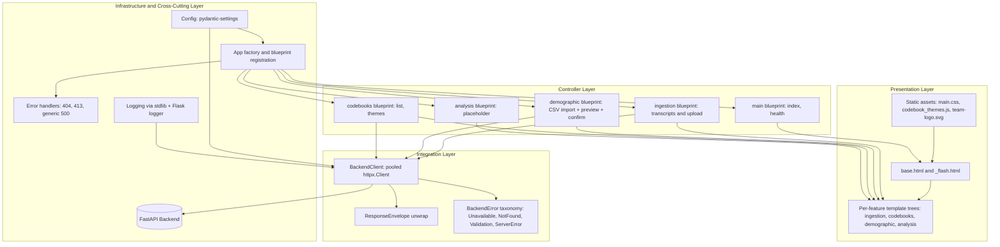

## 1. Architectural Overview

The frontend is organized as a layered server-rendered application. The observable structure indicates the following principal layers:

1. **Presentation layer**: Jinja2 templates, Bootstrap-5 styling, page-scoped JavaScript, and shared static assets.
2. **Controller layer**: Flask blueprints that bind URL paths to request handlers, perform input validation, and orchestrate redirects and flash messages.
3. **Integration layer**: an HTTP client that wraps every FastAPI backend call behind a typed error taxonomy.
4. **Infrastructure and cross-cutting layer**: Pydantic-settings configuration, Flask error handlers, request logging, and the app factory.



## 2. Main Component Responsibilities

| Component | Role | Primary collaborators |
|---|---|---|
| App factory (`web/__init__.py`) | Creates the Flask application, registers blueprints under their URL prefixes, installs error handlers, lazily instantiates the shared `BackendClient`, and registers an `atexit` hook to close it on process exit. | `Config`, all blueprints, `BackendClient` |
| `Config` (`web/config.py`) | Reads runtime configuration from environment variables via `pydantic-settings`. Defines `BACKEND_API_URL`, `BACKEND_TIMEOUT_S`, `SECRET_KEY`, `MAX_UPLOAD_SIZE_MB`, `MAX_UPLOAD_BYTES`, `MAX_CONTENT_LENGTH`, and the default workspace identifiers. | App factory, `BackendClient` |
| `BackendClient` (`web/services/backend_client.py`) | Single point of contact with the FastAPI backend. Pools connections, unwraps the `ResponseEnvelope` via a single `_unwrap` helper, translates HTTP and network failures into typed `BackendError` subclasses, and logs one structured line per failed request. | All blueprints, FastAPI backend |
| `main` blueprint | Renders the home page and exposes the container health check. | `templates/index.html` |
| `ingestion` blueprint | Resolves the workspace corpus, accepts transcript uploads, and lists corpus documents. Its Uploads page also hosts the demographic CSV upload card (the form posts to the `demographic` blueprint). | `BackendClient.ensure_corpus`, `upload_files`, `list_documents`; `templates/ingestion/` |
| `demographic` blueprint | Manages CSV demographic imports: preview, confirm, list confirmed files, view persisted rows with transcript linking. The upload **entry** lives on the `ingestion` blueprint's Uploads page; the legacy `/demographic/upload` URLs are kept as backwards-compatible redirects. | `BackendClient.upload_demographic`, `confirm_demographic`, `list_demographic_files`, `list_demographic_rows`, `get_demographic_link_summary`; `templates/demographic/` |
| `codebooks` blueprint | Renders the codebook list and the interactive theme browser. | `BackendClient.list_codebooks`, `get_theme_frequencies`, `get_theme_tree`; `templates/codebooks/` |
| `analysis` blueprint | Placeholder surface reserved for future analysis features. | `templates/analysis/index.html` |
| Error handlers (`web/__init__.py`) | Translate uncaught Flask errors into branded pages: 404, 413 (oversized upload — always redirects to home, never to a user-controlled `Referer`), and generic 500 without leaking tracebacks. | `templates/errors/` |

## 3. Route Catalogue

All routes are server-rendered. Where a backend call is made, the client method is listed; routes without one render entirely from configuration or session state.

### 3.1 `main` (no URL prefix)

| Method and path | Purpose | Backend call |
|---|---|---|
| `GET /` | Home page with quick-link cards | — |
| `GET /health` | Container health endpoint, returns `OK` | — |

### 3.2 `ingestion` — prefix `/transcripts`

| Method and path | Purpose | Backend call |
|---|---|---|
| `GET /transcripts/` | Resolve the default workspace corpus, then redirect to its corpus-scoped list view. | `ensure_corpus` |
| `GET /transcripts/upload` | Same resolve-then-redirect pattern, targeting the Uploads page. | `ensure_corpus` |
| `GET /transcripts/<corpus_id>/upload` | Render the Uploads page, which hosts **two side-by-side cards**: a multi-file picker for interview transcripts and a single-CSV picker for demographic data (the latter posts to the `demographic` blueprint). | — |
| `POST /transcripts/<corpus_id>/upload` | Validate sizes, forward the files to the backend, render per-file results. | `upload_files` |
| `GET /transcripts/<corpus_id>/` | List documents in a corpus. | `list_documents` |

### 3.3 `demographic` — prefix `/demographic`

| Method and path | Purpose | Backend call |
|---|---|---|
| `GET /demographic/` | Resolve corpus then redirect to its demographic list view. | `ensure_corpus` |
| `GET /demographic/upload` | **Backwards-compatible redirect** to `/transcripts/.../upload` on the `ingestion` blueprint. The standalone demographic upload page was removed; the entry now lives on the Uploads page. | `ensure_corpus` |
| `GET /demographic/<corpus_id>/` | List persisted demographic files for the corpus. | `list_demographic_files` |
| `GET /demographic/<corpus_id>/upload` | **Backwards-compatible redirect** to `/transcripts/<corpus_id>/upload`. | — |
| `POST /demographic/<corpus_id>/upload` | Submit the CSV from the Uploads page demographic card, obtain a preview with `import_id`, stash the preview in `flask.session` keyed by `import_id`. | `upload_demographic` |
| `GET /demographic/<corpus_id>/preview/<import_id>` | Render the preview of a pending import. **No backend call** — the preview payload is read from the session entry stashed at upload time. | — |
| `POST /demographic/<corpus_id>/preview/<import_id>` | Confirm (`action=confirm`) or cancel (`action=discard`) the pending import. Clears the session entry. | `confirm_demographic` |
| `GET /demographic/<corpus_id>/view/<file_id>` | Paginated view of a confirmed demographic file with transcript-linking badges. Catches `BackendNotFoundError` specifically to surface "That demographic file couldn't be found." | `list_demographic_files`, `list_demographic_rows`, `get_demographic_link_summary` |

### 3.4 `codebooks` — prefix `/codebooks`

| Method and path | Purpose | Backend call |
|---|---|---|
| `GET /codebooks/` | List all codebooks. | `list_codebooks` |
| `GET /codebooks/<codebook_id>/themes` | Interactive theme browser (frequency table + hierarchy tree + detail panel). Catches `BackendNotFoundError` specifically to surface "That codebook couldn't be found." | `get_theme_frequencies`, `get_theme_tree` |

### 3.5 `analysis` — prefix `/analysis`

| Method and path | Purpose | Backend call |
|---|---|---|
| `GET /analysis/` | Placeholder page reserved for future analysis features. | — |

## 4. Page Catalogue

Templates are organized by feature under `Frontend/web/templates/`. All templates extend `base.html`, which carries the Bootstrap 5 layout, navbar, footer, favicon, and the `_flash.html` partial.

### 4.1 Shared

| Template | Purpose |
|---|---|
| `base.html` | Bootstrap layout, navbar with the NIM+AMOS team logo, 3-column partnership footer (NIM + OSS@FAU), favicon, flash partial inclusion, and a sticky-bottom flex layout so the footer stays at the viewport bottom on short pages |
| `_flash.html` | Dismissible alert partial with category-specific icons; `success` and `info` auto-dismiss after 5 s, `warning` and `danger` persist until the user closes them |
| `index.html` | Home page quick-link cards |
| `errors/404.html` | Branded "page not found" |
| `errors/500.html` | Branded "server error" — never leaks tracebacks |

### 4.2 Ingestion

| Template | Purpose |
|---|---|
| `ingestion/upload.html` | Hosts **two side-by-side cards**: a transcripts card (multi-file picker with dynamic JS-driven file list, per-file size validation, total-size feedback, indigo gradient header, `.btn-indigo` submit) and a demographic card (single-CSV picker, optional import name, teal gradient header, `.btn-teal` submit). Both share the hover-lift and themed-button conventions described in §8. |
| `ingestion/results.html` | Per-file ingestion result summary returned by the backend |
| `ingestion/list.html` | Paginated transcript list for one corpus |

### 4.3 Demographic

| Template | Purpose |
|---|---|
| `demographic/preview.html` | Pending-import preview with confirm / cancel actions |
| `demographic/list.html` | List of confirmed demographic files for one corpus; the "Upload CSV" button links back to the Uploads page |
| `demographic/view.html` | Paginated row view of one demographic file, with transcript-linking badges |

The standalone `demographic/upload.html` was removed; the upload form lives on the Uploads page (see §4.2).

### 4.4 Codebooks

| Template | Purpose |
|---|---|
| `codebooks/list.html` | Codebook list |
| `codebooks/themes.html` | Theme browser: frequency table, hierarchy tree, and detail panel. Driven by `static/js/codebook_themes.js` |

### 4.5 Analysis

| Template | Purpose |
|---|---|
| `analysis/index.html` | Placeholder page |

## 5. Backend Integration Surface

`BackendClient` is the only point in the frontend that knows the FastAPI URL shape. It exposes one method per backend interaction.

| Method | Endpoint | Used by |
|---|---|---|
| `list_corpora(project_id)` | `GET /ingestion/corpora` | `ensure_corpus` |
| `create_corpus(project_id, name)` | `POST /ingestion/corpora` | `ensure_corpus` |
| `ensure_corpus(project_id, name)` | derived | All landing routes |
| `upload_files(corpus_id, files)` | `POST /ingestion/corpora/{id}/upload` | Transcript upload |
| `list_documents(corpus_id)` | `GET /ingestion/corpora/{id}/documents` | Transcript list |
| `list_codebooks()` | `GET /codebooks/` | Codebook list |
| `get_theme_frequencies(codebook_id)` | `GET /codebooks/{id}/themes` | Theme browser |
| `get_theme_tree(codebook_id)` | `GET /codebooks/{id}/themes/tree` | Theme browser |
| `upload_demographic(corpus_id, file, name)` | `POST /demographic/{corpus_id}/upload` | Demographic upload |
| `confirm_demographic(corpus_id, import_id, confirm)` | `POST /demographic/{corpus_id}/confirm` | Demographic preview |
| `list_demographic_files(corpus_id)` | `GET /demographic/{corpus_id}/files` | Demographic list |
| `list_demographic_rows(corpus_id, file_id, page, page_size)` | `GET /demographic/{corpus_id}/rows` | Demographic file view |
| `get_demographic_link_summary(corpus_id)` | `GET /demographic/{corpus_id}/link-summary` | Demographic linking summary |

Every method passes through a single `_unwrap(response, sub_key=None)` helper that peels the FastAPI `{success, data, error, meta}` envelope. The envelope shape lives in exactly one place; if the backend ever changes it, only `_unwrap` needs updating.

## 6. Error Model

A four-layer model is used. The categorisation lives in `BackendClient`; controllers catch the typed exception and surface `exc.user_message` via `flash`; templates render error- vs. empty-state separately; Flask error handlers catch what escapes.

| Exception class | Raised when | Default user message | Log level |
|---|---|---|---|
| `BackendError` (base) | Uncategorised failure: malformed JSON, missing keys | "Something went wrong. Please try again." | `error` |
| `BackendUnavailableError` | Connect refused, DNS failure, read timeout | "We can't reach the analysis service right now. Please try again in a moment." | `warning` |
| `BackendNotFoundError` | Backend returns HTTP 404 | "The requested item couldn't be found. It may have been deleted." | `info` |
| `BackendValidationError` | Backend returns HTTP 422 — FastAPI's structured `detail[].msg` is parsed per field | A per-field message, e.g. `"name: field required; themes: must contain at least 1 item"` | `info` |
| `BackendServerError` | Backend returns 5xx | "The analysis service had a problem. The team has been notified." | `error` |

Controllers that hit a resource by id (e.g. `codebook_themes`, `demographic.view_data`) catch `BackendNotFoundError` separately to surface a resource-specific message. Generic `BackendError` is the fallback.

Every failed request is logged once at the `BackendClient` boundary at a level matching the exception class.

Data-loading templates follow a three-way conditional so an error alert and an empty-state line never appear together:

```jinja

  <p class="text-secondary">Couldn't load this section.</p>

  ...

  <p class="text-secondary">No items yet.</p>

```

Flask-level error handlers catch what escapes the controllers:

- **404** — renders `errors/404.html`.
- **413** — flashes "Upload too large…" and redirects to the home page via `url_for("main.index")`. **Always home** — never the `Referer` header — to eliminate the open-redirect class of vulnerability (CWE-601).
- **Generic `Exception`** — logs the full traceback via `logger.exception`, renders `errors/500.html`. Re-raises `HTTPException` so the 404 and 413 handlers still run for those specific codes.

## 7. Configuration

The frontend reads its configuration from environment variables (or a local `.env`). The values shipped on the `frontend` service in `docker-compose.yml` cover the in-cluster URL; the table below shows the user-meaningful settings.

| Variable | Default | Purpose |
|---|---|---|
| `BACKEND_API_URL` | `http://localhost:8000/api/v1` | Base URL of the FastAPI backend. In Docker this is `http://api:8000/api/v1`. |
| `BACKEND_TIMEOUT_S` | `60.0` | HTTP client timeout |
| `SECRET_KEY` | `dev-secret` | Flask session signing key. **Override for production.** |
| `APP_ENV` | `development` | `development` enables debug-friendly behaviour |
| `LOG_LEVEL` | `INFO` | Both Flask and `BackendClient` log at this level |
| `MAX_UPLOAD_SIZE_MB` | `10` | Per-file upload cap; Werkzeug rejects oversized bodies with 413 |
| `DEFAULT_PROJECT_ID` | `00000000-0000-0000-0000-000000000001` | Single-workspace MVP project identifier |
| `DEFAULT_CORPUS_NAME` | `Interview Transcripts` | Name used when auto-creating the workspace corpus |

`MAX_CONTENT_LENGTH` (the Flask raw-request-body cap that triggers a 413) is derived as `MAX_UPLOAD_SIZE_MB × 10 × 1024 × 1024` — about 100 MB by default — so Werkzeug rejects oversized payloads before fully buffering them.

## 8. Design System

The frontend uses a small, deliberate visual vocabulary. **New pages should reuse these primitives rather than introducing one-off styling.** If you find yourself reaching for inline styles or a custom class, check §8.8 first.

### 8.1 Bootstrap and stylesheet organisation

Bootstrap 5.3.3 is loaded from `cdn.jsdelivr.net` with an SRI integrity hash, declared in `templates/base.html`. No build step, no Bootstrap Icons, no Bootstrap extensions. We rely on default Bootstrap utility classes (`d-flex`, `gap-2`, `text-secondary`, `mb-3`, `bg-white`, `rounded-3`, etc.) wherever possible, and add custom classes only when Bootstrap can't express the intent.

`static/css/main.css` is the **only** custom stylesheet. It is sectioned with `/* ── Section name ─────── */` headings by feature. New rules go into the matching section, not appended at the end. The current sections (top-to-bottom):

| Section | Purpose |
|---|---|
| Theme browser page header | `.theme-page-header`, `.theme-version-badge` |
| Metric cards | `.metric-card`, `.metric-card--indigo/cyan/teal` |
| Panel section titles | `.panel-title` |
| Frequency table | `.theme-table-head`, `.theme-row-*`, `.theme-progress*` |
| Tree with connector lines | `.tree-*` |
| Theme Details panel | `.td-*` |
| Header brand logo | `.navbar-brand-logo`, `.site-navbar` |
| Sticky-bottom layout | `.site-body`, `.site-main`, `.site-footer` |
| Site footer | `.footer-*` |
| Upload cards | `.upload-row`, `.upload-card*` |
| Themed submit buttons | `.btn-indigo`, `.btn-teal` |
| File list rows | `.file-list-item`, `.file-list-remove` |

### 8.2 Colour identity

| Role | Colour | Where it appears |
|---|---|---|
| Institutional chrome | NIM red `#D7102D` + dark navy `#232B35` | Team logo (navbar + footer + favicon) |
| Content brand | Indigo `#3730a3 → #4f46e5 → #6366f1` | Theme-browser page header, metric cards, panel-title accents, footer accent line, transcripts upload card |
| Complementary content brand | Teal `#0f766e → #14b8a6` | Demographic upload card, future analysis-side surfaces |
| Frequency progress bands | Rose 0–33 %, amber 34–66 %, emerald 67–100 % | Theme-browser coverage bars |

Dominant solid colours pulled from each gradient (used for buttons and accents):

| Token | Hex |
|---|---|
| Indigo deep | `#4338ca` |
| Indigo hover | `#3730a3` |
| Indigo disabled | `#c7d2fe` |
| Indigo selected-row tint | `#eef2ff` |
| Teal deep | `#0f766e` |
| Teal hover | `#115e59` |
| Teal disabled | `#ccfbf1` |

### 8.3 Reusable component classes

Full catalogue. Use these first; introduce a new class only when none of these fit.

**Cards and containers**

| Class | When to use |
|---|---|
| `.upload-card`, `.upload-card--indigo`, `.upload-card--teal` | Side-by-side upload entry points with gradient header strip, hover-lift, themed accent |
| `.metric-card`, `.metric-card--indigo`, `.metric-card--cyan`, `.metric-card--teal` | Stat cards with large numeric value and small uppercase label (theme browser) |
| `.theme-page-header` | Indigo gradient hero for theme-browser-style pages |
| `.panel-title` | Section heading inside a panel; indigo left-border accent |
| `.upload-row` | Soft max-width cap (1080 px) for the Uploads page row |

**Buttons**

| Class | When to use |
|---|---|
| `.btn-indigo` | Primary submit on an indigo-themed surface |
| `.btn-teal` | Primary submit on a teal-themed surface |

**File pickers**

| Class | When to use |
|---|---|
| `.file-list-item` | Borderless row for a selected file (name + size + hover tint) |
| `.file-list-remove` | Circular X-icon remove button |

**Tree (theme browser)**

| Class | When to use |
|---|---|
| `.tree-root`, `.tree-children`, `.tree-group`, `.tree-child-item` | Hierarchy tree connector lines |
| `.tree-root-row`, `.tree-child-row` | Tree node rows |
| `.tree-toggle`, `.tree-toggle-gap` | Expand/collapse arrows |

**Layout chrome**

| Class | When to use |
|---|---|
| `.site-body`, `.site-main`, `.site-footer` | Sticky-bottom flex layout on `<body>` |
| `.site-navbar` | Branded navbar background |
| `.site-flash` | Flash alert wrapper (auto-dismiss for success/info) |

### 8.4 Themed submit buttons

`.btn-indigo` and `.btn-teal` are flat solid buttons (background pulled from the dominant colour of each gradient — a compressed gradient on a small button reads as washed-out). They share a hover-darkening + soft glow + active-press pattern. The disabled state shows a muted variant and overrides Bootstrap's `pointer-events: none` so the `cursor: not-allowed` indicator actually renders.

### 8.5 File pickers

The `.file-list-item` + `.file-list-remove` pair is the canonical "selected file" affordance: borderless row with file name + size, hover tint, oversize-red tint when over the size cap, circular X-icon remove button. Used by both the transcripts multi-file list and the demographic single-file indicator.

### 8.6 Interaction patterns

| Pattern | What | Where it's used |
|---|---|---|
| Hover-lift | `transform: translateY(-4px)` + grown box-shadow on `:hover` | Upload cards |
| Click-press | `transform: translateY(-2px)` + reduced shadow on `:active` | Upload cards |
| Disabled cursor | `cursor: not-allowed` + `pointer-events: auto` override on `:disabled` (Bootstrap's default `pointer-events: none` hides the cursor change) | Themed submit buttons |
| Dismissible flash | `success` and `info` alerts auto-dismiss after 5 s via a small JS snippet in `base.html`; `warning` and `danger` persist | Flash partial |
| Three-way data-loading conditional | ` ...  ...  empty-state ` so error and empty-state never appear together | All data-loading templates |

### 8.7 Icons

We use inline SVG (Lucide / Heroicons style: `viewBox="0 0 24 24"`, `fill="none"`, `stroke="currentColor"`, `stroke-width="1.8"` or `2.4`, `stroke-linecap="round"`). No icon font, no SVG sprite. Convention:

| Use | Size |
|---|---|
| Card header | `width/height: 26-32px` |
| Inline control (remove buttons, toggles) | `width/height: 13-16px` |

Icons currently in use: `document-text` (transcripts upload card), `users` (demographic upload card), `x` (file-list-remove), expand/collapse arrows in the tree (pure CSS triangle, not SVG).

### 8.8 Before adding new CSS — checklist

Run through this before writing a new rule in `main.css`:

1. **Does a Bootstrap utility cover it?** Spacing (`m-*`, `p-*`, `gap-*`), display (`d-flex`, `d-grid`), text (`text-secondary`, `fw-semibold`), borders (`border`, `rounded-2`), colours (`bg-light`, `text-bg-success`). If yes, use that — no new rule needed.
2. **Does an existing custom class cover it?** Check §8.3. The catalogue is shorter than people think — most pages can be built from `.upload-card` / `.metric-card` / `.panel-title` / themed buttons + Bootstrap utilities.
3. **Is it a page-specific JS interaction?** If the styling exists only because of a JS state change (selected row, expanded tree node), the *class name* can live in `main.css` (e.g. `.tree-root-row.selected`) but the *event wiring* belongs alongside the JS in the template, not duplicated as CSS.

If all three answers are no, add it to `main.css` under the right `/* ── Section ─ */` heading. If it's a pattern more than one page might want, give it a class name that describes intent (`.upload-card`), not appearance (`.blue-box`). Update §8.3 of this wiki in the same commit so it stays discoverable.

### 8.9 Examples — preferred and discouraged

| Don't | Do |
|---|---|
| `<button style="background: #4338ca; color: white;">Save</button>` (inline styles, hard-coded colours) | `<button class="btn btn-indigo">Save</button>` |
| `.my-feature-blue-button { background: #6366f1; ... }` (one-off class named for the feature) | Use `.btn-indigo` — same colour, intent-based name, already exists |
| `.feature-x-card { background: #fff; border: 1px solid #e5e7eb; border-radius: 14px; }` for a new card | Use the existing Bootstrap utilities `bg-white border rounded-3 p-3` |
| `style="margin-top: 20px;"` | `class="mt-3"` (Bootstrap utility, consistent spacing scale) |
| Adding a new icon as a base64-embedded PNG | Inline SVG following the Lucide/Heroicons convention in §8.7 |
| Duplicating an `.upload-card` lookalike on a new page | Reuse `.upload-card` with a new `.upload-card--<colour>` modifier if you need a different accent |
## 9. Upload-Flow Contract

Two flow shapes coexist in the app:

| Flow | Used by | Steps | State management |
|---|---|---|---|
| **Single-step** | Transcripts upload | Upload → backend persists immediately → render per-file results | None — request/response is self-contained |
| **Two-step** | Demographic upload | Upload → backend stages a pending file and returns a preview with `import_id` → user confirms or cancels on a separate page → backend persists or discards | The preview payload is stashed in `flask.session` under key `demo_preview_<import_id>`. The preview page reads the session entry; no backend re-fetch happens. The confirm route pops the entry after dispatching to backend. |

The two-step flow exists because the backend enforces strict CSV validation (column membership, username uniqueness, row-count bounds) and the team decided researchers should always see what was parsed before persisting. Future features that need user review before commit should follow the same pattern.

The `import_id` is a UUID that the backend generates on upload and embeds in both the preview page URL and the session key. Pending uploads expire on the backend after `DEMOGRAPHIC_UPLOAD_TTL_SECONDS`; the frontend gracefully handles the missing-session case with a flash + redirect back to the Uploads page.

## 10. Development Workflow

Day-to-day commands, troubleshooting, and the dev/test stack are documented in `Frontend/README.md` in the repository. One environmental gotcha worth highlighting here:

**Schema drift on the Postgres volume.** The project has no migration framework today; schema is created by `SQLAlchemy.create_all()` on app start, which only adds missing tables — not missing columns. Any time the backend team adds a column to an existing model (e.g. the `demographic_row_id` column on `corpus_documents` for the demographic-linking feature), anyone whose local `pgdata` volume predates that commit will see `UndefinedColumnError` on any insert touching the new column. Cure:

```bash
docker compose down -v && docker compose up -d
```

This recreates the volume with the current schema. Loses all locally uploaded test data — re-upload from `demo_data/` to recover.

## 11. Testing Strategy

The frontend test suite lives under `Frontend/tests/`. Tests never hit the network — a `FakeBackend` fixture in `conftest.py` monkey-patches the BackendClient factory in every controller blueprint.

| File | Coverage |
|---|---|
| `test_smoke.py` | Health, home, and basic per-route reachability |
| `test_ingestion.py` | Transcript upload + list flows, including typed-error paths |
| `test_codebooks.py` | Codebook list + theme browser flows, including `BackendNotFoundError` |
| `test_demographic.py` | Demographic upload (via Uploads page redirect), preview, confirm/discard, file view, linking |
| `test_backend_client.py` | Unit tests for `BackendClient` exception categorisation using `httpx.MockTransport` |
| `test_error_handlers.py` | 404, 413, and generic 500 handlers, including the open-redirect guard on 413 |

To simulate a specific backend exception in a controller test, set the fixture's `raise_on`:

```python
fake_backend.raise_on = ("upload_demographic", BackendValidationError)
```

This is the canonical pattern for adding new typed-error tests. The `(method_name, ExceptionClass)` tuple form raises that specific subclass; a bare method-name string raises generic `BackendError`.
